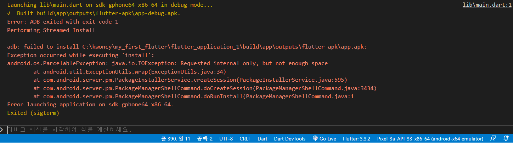
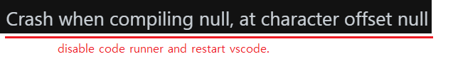
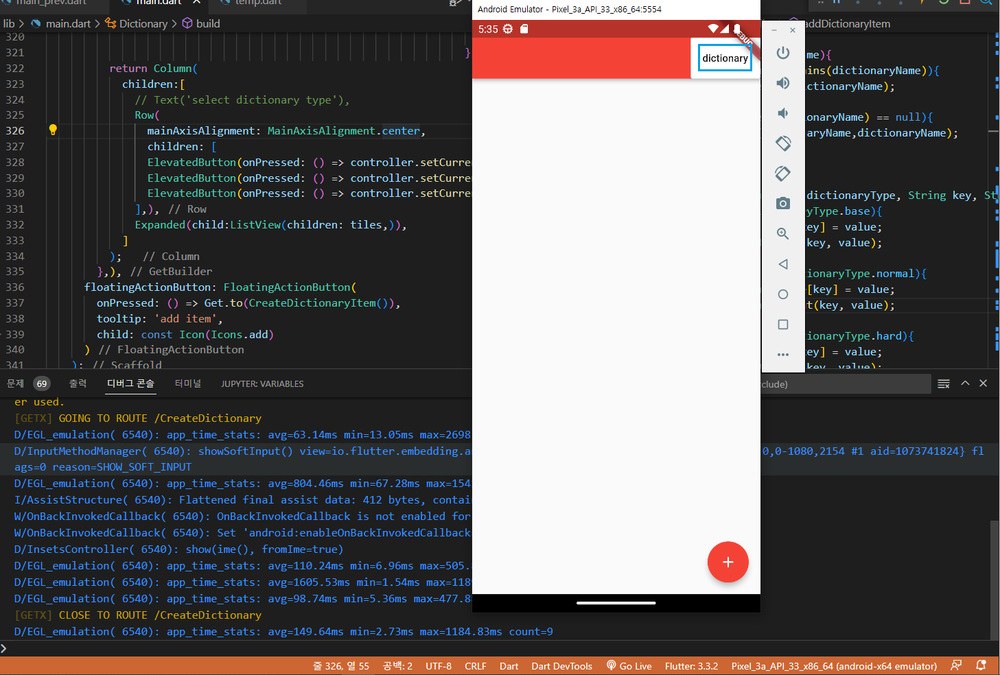
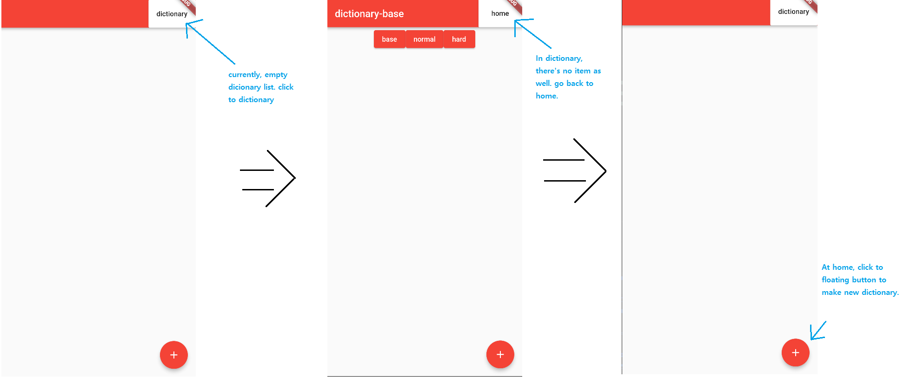
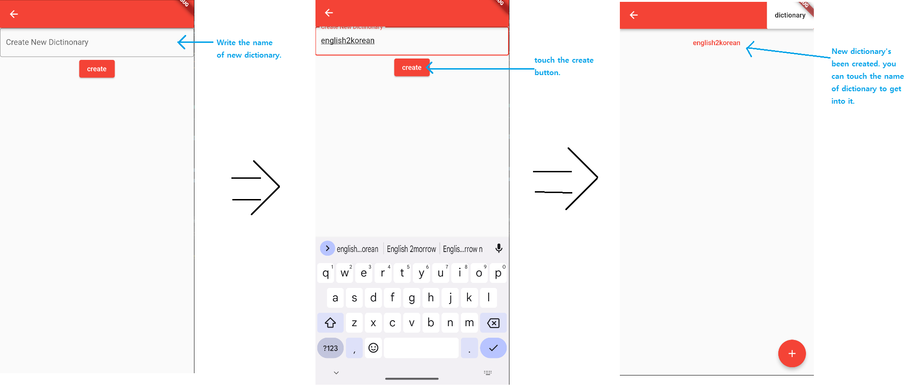
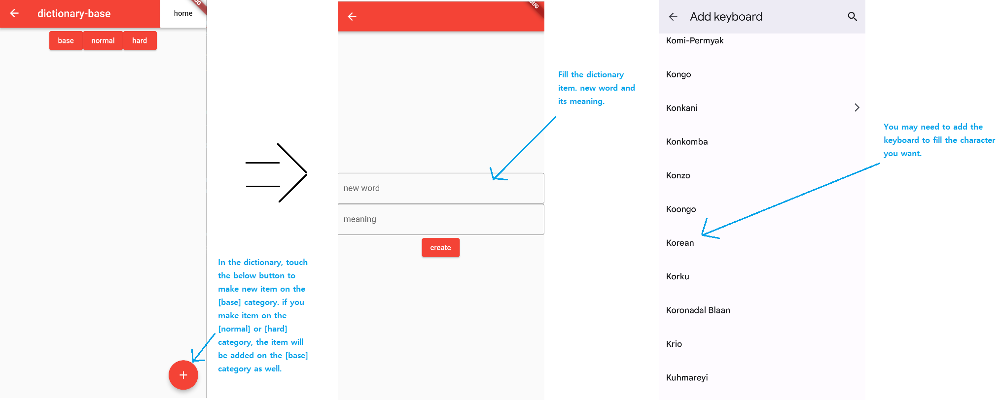
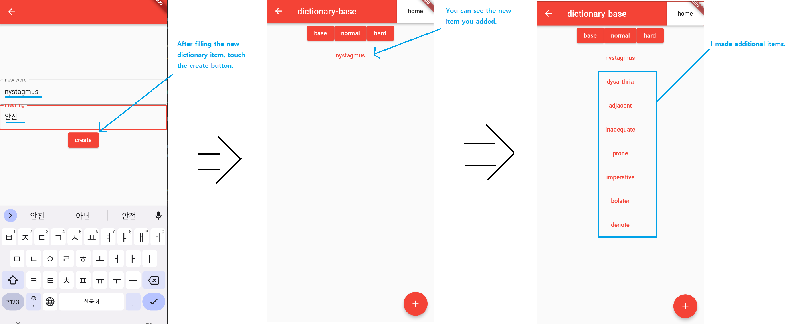
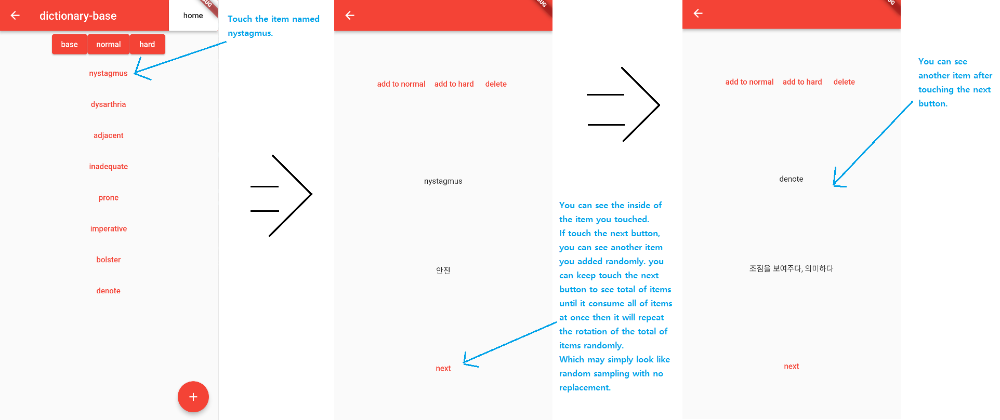
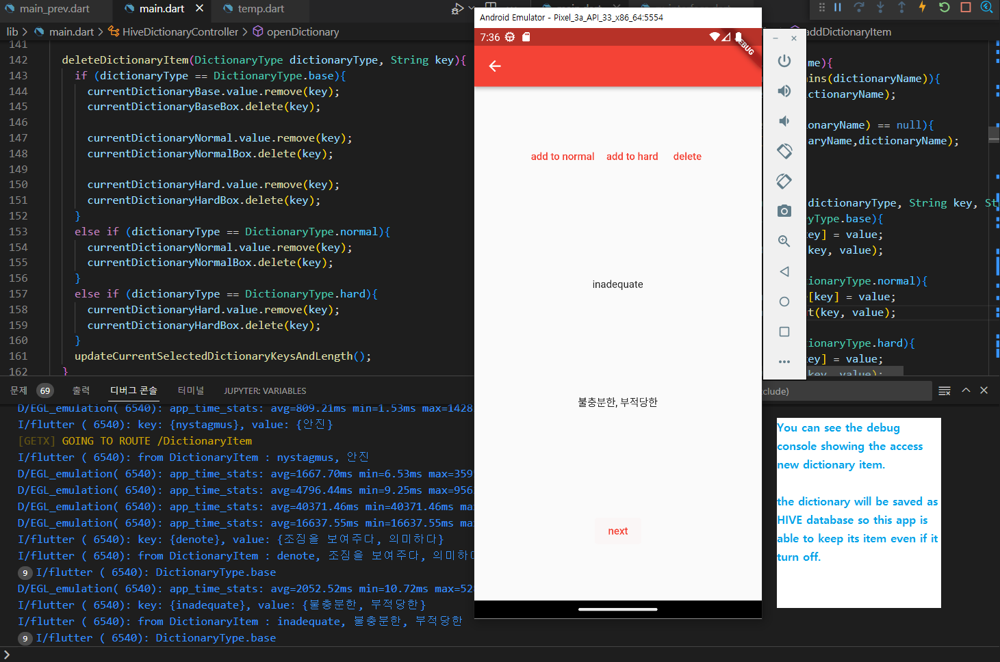
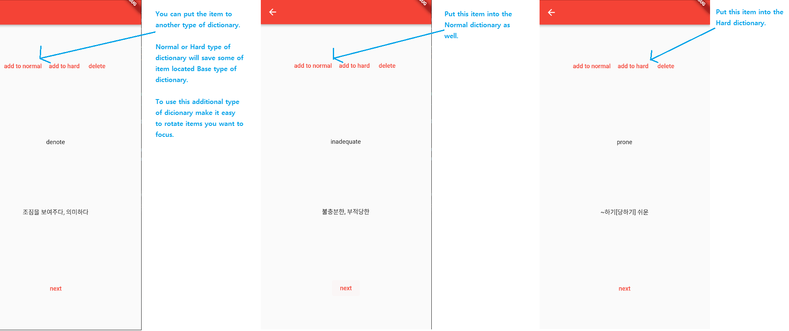

# My first flutter app (GetX, Hive)

This is my first flutter app. While I working as a AI researcher, I Interested in developing web app and mobile app containing AI if it's possible.
I just able to get some time after my job. so this simple app took quite much time than I expected.
After I studied the dart language which is required to develop the flutter app, I tried to make this app. it took around 1 month (in the middle of Oct. to middle of Nov.)

Additional library named GetX and Hive will be required if you try to run this app. As you can see on my main.dart, I try to practice to use several ways on the GetX such as GetBuilder, update method with no .obs variable and GetX<some-class> with .obs variable. and there's no seperation between view and controll because of its short lines.

***
* First of all, you may face below error. you can expand the size of storage on the android emulator.

  
***
* You may encounter another below error if you use vscode. this will fix when unabling the extension named code-runner. 

  
***
* You can see the app front (dictionary list). currently empty. and its iupper-right, there's button named dictionary. you can touch it but there'no item at all at this time.

  
***
* You can route home and dictionary this route is named route through the GetX.

  
***
* Create new Dictionary. this Dictionary and its item will be saved through the Hive (kinds of NoSQL)

 
***
* Inside the dictionary, you can create dictionary item. you may need to add keyboard.

  
***
* Add items.

  
***
* Rotate the items with next button.

  
***
* Debug console.

  
***
* You can add some items to normal-type-dictionary or hard-type-dictionary. this will help you to rotate some items you want to focus.

  
